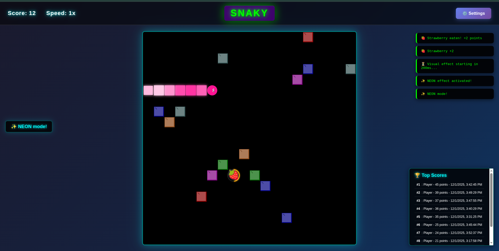

# 🐍 Snaky - The Ultimate Snake Game Experience



Welcome to **Snaky**, a modern, high-octane twist on the classic snake game! Dive into a neon-lit world where survival isn't just about eating—it's about strategy, shooting, and style.

## 🚀 Why Play Snaky?

Get ready for features that take the classic gameplay to the next level:

*   **🍓 Deliciously Dangerous Food**: Not just apples! Hunt for Grapes, Oranges, and even **Beer** (watch out for the drunk effect!)—but avoid the Toxic waste!
*   **🔫 Shoot Your Way Through**: Trapped? Blast destructible obstacles with your built-in shooter!
*   **✨ Stunning Visuals**: Enjoy particle explosions, animated trails, and vibrant themes like **Neon**, **Fire**, and **Metal**.
*   **📱 Play Anywhere**: Fully responsive design with virtual joystick controls for mobile gaming.
*   **🎨 Total Customization**: Choose your snake's skin, color, and speed. Make it yours!
*   **🏆 Climb the Ranks**: Compete for the top spot on the local high-score board.

## 🎮 Getting Started

Run the game locally in seconds with modern web tools!

### Prerequisites
- Node.js (v18+ recommended)
- npm

### Installation

1.  **Clone the repository**:
    ```bash
    git clone https://github.com/mehrawbmh/Snaky.git
    cd Snaky
    ```

2.  **Install dependencies**:
    ```bash
    npm install
    ```

3.  **Start the game**:
    ```bash
    npm run dev
    ```

    Open the link provided in the terminal (usually `http://localhost:5173`) and start slithering!

## 🕹️ Controls

| Action | Desktop (Keyboard) | Mobile |
| :--- | :--- | :--- |
| **Move** | Arrow Keys / WASD | Virtual D-Pad |
| **Shoot** | Enter | Center Button (🔫) |
| **Speed Up** | Space | - |
| **Slow Down** | Shift + Space | - |

---

**Ready to slither? [Play Now!](#)** 🐍✨
